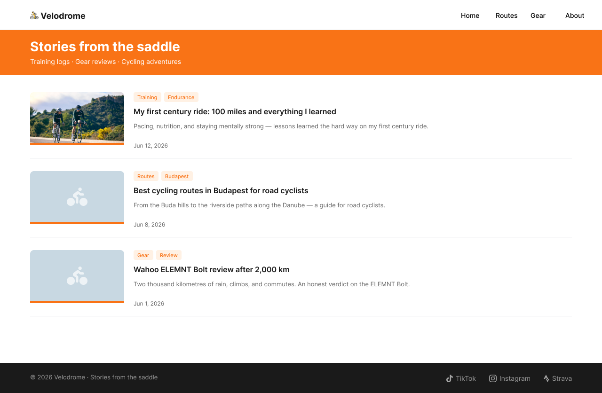
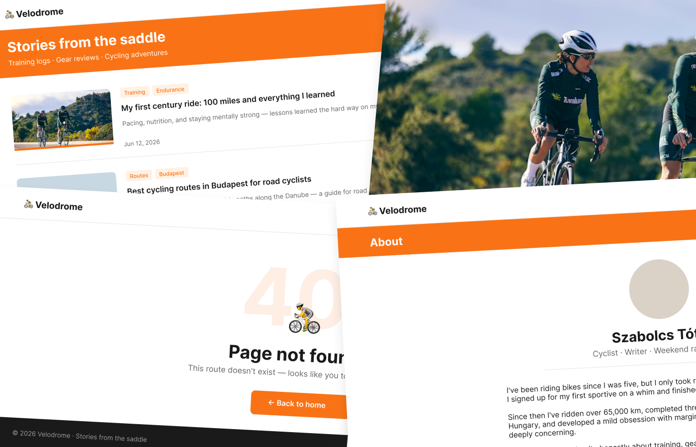

# Velodrome

A cycling blog template for [Toucan](https://toucansites.com/). Built for road cyclists who want a fast, readable blog with tag filtering.

---




---

## Pages

| Page | View | Description |
|---|---|---|
| Home | `pages.home` | Post listing with tag chips and pagination |
| Single post | `blog.post` | Full-width hero image, article body, tag chips |
| Tag listing | `blog.tag` | Filtered post list for a given tag |
| About | `pages.about` | Author bio with avatar placeholder |
| 404 | `pages.404` | Not found page |

---



---

## Installation

Add the template as a git submodule inside your Toucan project:

```bash
$ git submodule add https://github.com/kicsipixel/velodrome-template templates/velodrome
```

Then set it as the active template in `config.yml`:

```yaml
templates:
    current:
        path: velodrome
```

---

## Content types

The template expects two custom content types in your project. Create the following files:

**`types/post.yml`**
```yaml
id: post
paths:
    - blog/
properties:
    title:
        type: string
        required: true
    description:
        type: string
        required: true
    date:
        type: date
        required: false
    imageUrl:
        type: string
        required: false
    imageCaption:
        type: string
        required: false
    taglist:
        type: string
        required: false
```

**`types/tag.yml`**
```yaml
id: tag
paths:
    - tags/
properties:
    title:
        type: string
        required: true
    description:
        type: string
        required: false
queries:
    posts:
        contentType: post
        scope: list
        filter:
            key: taglist
            operator: like
            value: "{{id}}"
        orderBy:
            - key: date
              direction: desc
```

Add both `post` and `tag` to `contentTypes` in your pipeline, and wire `post → blog.post` and `tag → blog.tag` in the engine options.

---

## Writing posts

Create posts at `contents/blog/<slug>/index.md`:

```yaml
---
type: post
title: "Your post title"
description: "One-line summary shown in post cards."
date: "2026-06-12 09:00:00"
imageUrl: "/images/your-image.jpg"
imageCaption: "Photo by Author"
tags:
    - training
    - endurance
taglist: "training endurance"
---

Post body goes here.
```

> **Note:** The `taglist` field must mirror your `tags` array as a space-separated string. This is required due to a known RC1 limitation — array filtering is not yet supported.

---

## Tags

Create a content file for each tag at `contents/tags/<slug>/index.md`:

```yaml
---
type: tag
title: "Training"
---
```

---

## Image sizes

One image per post — the same file is used for both the full-width hero and the card thumbnail. The template crops it with CSS `object-fit: cover`, no server-side processing required.

| Slot | Display size | Recommended minimum |
|---|---|---|
| Hero (single post, full width) | 1280 × 483 px | 1280 × 483 px |
| Thumbnail (index / tag listing) | 200 × 112 px | 400 × 224 px (2× for retina) |

If no `imageUrl` is set, a bicycle placeholder is shown automatically.

Images inside the post body are standard Markdown — add as many as you like:

```markdown

```

---

<!-- screenshot: single post with hero image -->

---

## About page

Set `views: html: pages.about` in `contents/about/index.md` and add two fields:

```yaml
authorName: "Your Name"
authorTagline: "Cyclist · Writer · Weekend racer"
```

The page body becomes your bio.

---

## Navigation

Edit `site.yml` to control the nav links:

```yaml
navigation:
    - label: "Home"
      url: "/"
    - label: "Routes"
      url: "/routes/"
    - label: "Gear"
      url: "/gear/"
    - label: "About"
      url: "/about/"
```

---

## Social links in the footer

Edit `views/partials/footer.mustache` to update the social links and point the `src` values at your own icon assets.

You can also use [Font Awesome](https://fontawesome.com) icons via their CDN. Add the kit script to `views/html.mustache` just before `</head>`:

```html
<script src="https://kit.fontawesome.com/YOUR_KIT_CODE.js" crossorigin="anonymous"></script>
```

Then replace the `` icon tags in `footer.mustache` with Font Awesome elements:

```html
<a href="https://www.strava.com/athletes/you" aria-label="Strava">
    <i class="fa-brands fa-strava"></i>
</a>
<a href="https://instagram.com/you" aria-label="Instagram">
    <i class="fa-brands fa-instagram"></i>
</a>
<a href="https://www.tiktok.com/@you" aria-label="TikTok">
    <i class="fa-brands fa-tiktok"></i>
</a>
```

Get a free kit code at [fontawesome.com/start](https://fontawesome.com/start) — the free tier includes all brand icons (Strava, Instagram, TikTok, X, YouTube, and more).

---

## License

[MIT](./velodrome/LICENSE)
